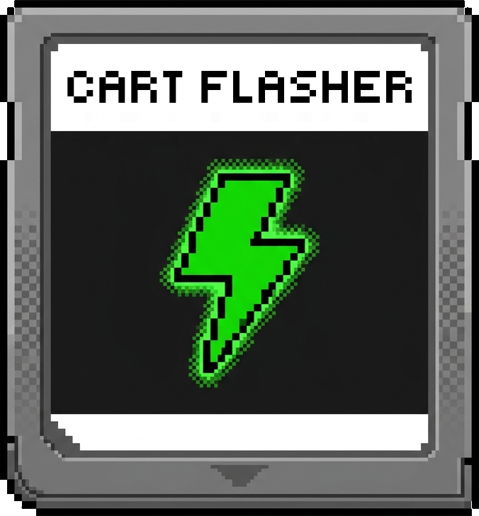

<p align="center">
  
</p>

# Cart-Flasher

A DS/DSi homebrew application to backup and restore raw flash images to/from Slot-1 flashcarts.

## Getting started

Download the latest [`cart_flasher.nds`](https://github.com/tasken/Cart-Flasher/releases/latest/download/cart_flasher.nds) and place it on your flashcart's SD card.

1. Boot into your flashcart menu, and launch Cart-Flasher.
1. Accept the warning by pressing `A`.
1. Select your cart in the cart list.
1. To save a copy of your cart, select `Back up flash`, then press `A` to start. Your dump is saved to `cart-backups` on the SD card.
1. To write a flashrom back, select `Write flash`, pick your `.bin` file, then input the key combo to proceed.
1. Wait until the progress bar finishes, then press `A`.

> [!TIP]
> Keep a copy of your first dump somewhere off the SD card. Dumping the same cart again overwrites the old file.

## Supported carts

Ace3DS+, Acekard 2i, DSTT, R4i Gold 3DS, R4iSDHC family, and R4 SDHC Dual-Core (DSi mode only).

`Sanras`'s [flashcart guide](https://sanrax.github.io/flashcart-guides/) covers which retail carts these map to, and has a full walkthrough for [changing a flashcart's banner](https://sanrax.github.io/flashcart-guides/tutorials/icon-change/) using this tool.

> [!CAUTION]
> **Breaks stock DSi/3DS compatibility**
>
> Changing the icon or banner text of a flashcart will cause it to be blocked by DSi and 3DS firmware, *unless* CFW (Custom Firmware) is installed on the console. NDS and DS Lite are not affected by this, as they do not do any integrity checks on the game being loaded.
>
> This only applies to banners you have changed. Restoring your own untouched backup is fine.

> [!WARNING]
> Not every cart has been tested. If you can't dump the flashrom for your cart, or the resulting dump is nonsense, STOP and do not proceed any further. [Open an issue](https://github.com/tasken/Cart-Flasher/issues) and provide information about your cart and setup.
>
> Use real hardware. Emulators can't emulate a flashcart, so a detection there means nothing even when it looks like it worked.
>
> And as always, flashing carts and modifying firmware carries a risk. We are not responsible for any damage that may occur, such as bricked carts.

## Reporting a problem

1. Press `Y` on the cart list until the log reads `DEBUG`.
1. Do the thing that went wrong again.
1. Power off, and grab `cart_flasher.log` from the root of your SD card.
1. [Open an issue](https://github.com/tasken/Cart-Flasher/issues) with the log attached, which cart you have, and how you launched Cart-Flasher.

> [!NOTE]
> If you saw `SD card init failed!`, there is no log to send. Take a photo of the screen and attach that instead.

## Building

```shell
git clone https://github.com/tasken/Cart-Flasher.git
cd Cart-Flasher/
sudo ./build.sh
```

This builds inside Docker (BlocksDS toolchain included) and produces `cart_flasher-<commit>.nds`. If you already have BlocksDS installed locally, `make` works directly without Docker.

## Credits

*   Developed by `Tasken` (`Nimbo` on Discord)
*   Upstream base: repurposed as a general-purpose flashcart dump/write tool, built on top of:
    *   [ntrboot_flasher_nds](https://github.com/jason0597/ntrboot_flasher_nds) by `jason0597` (original project)
    *   [ntrboot_flasher_nds](https://github.com/DS-Homebrew/ntrboot_flasher_nds) by `DS-Homebrew` (enhanced fork)
*   Drivers & core:
    *   [flashcart_core](https://github.com/ntrteam/flashcart_core) by `ntrteam`, for the per-flashcart device drivers
    *   [libncgc](https://github.com/angelsl/libncgc) by `angelsl`, for the NTR/CTR card protocol layer

Special thanks to `Sanras` for feedback and pre-release testing, and make sure to check out his [flashcart guide](https://sanrax.github.io/flashcart-guides/).

The key combo confirmation before writing to a cart is styled after `d0k3`'s [GodMode9](https://github.com/d0k3/GodMode9) unlock sequence prompt.

## License

GPL-3.0 - see [LICENSE](LICENSE).

Copyright © the original `ntrboot_flasher_nds` authors and later contributors
(see Credits above, and the git history for per-change authorship). The vendored
`flashcart_core` and `libncgc` are also GPL-3.0, under their own `LICENSE` and
`MODIFICATIONS.md`.
